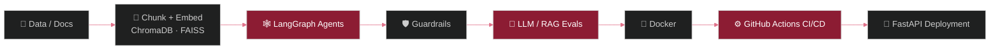

<a name="top"></a>

<!-- ═════════════════ HERO ═════════════════ -->


<div align="center">

<a href="https://github.com/saifullah857"></a>


<!-- NAVBAR -->
<p>
<a href="#about"></a>
<a href="#skills"></a>
<a href="#exploring"></a>
<a href="#projects"></a>
<a href="#stats"></a>
<a href="#roadmap"></a>
<a href="#contact"></a>
</p>

<!-- CTA -->
<a href="https://saifullah857.github.io/saif-ullah-portfolio/"></a>
<a href="mailto:ranasaifullahkhalid2@gmail.com"></a>
<a href="https://www.linkedin.com/in/saif-ullah-khalid-412221379/"></a>

<br/>

[](https://github.com/saifullah857)
[](https://github.com/saifullah857?tab=followers)
[](https://github.com/saifullah857?tab=repositories)
[](mailto:ranasaifullahkhalid2@gmail.com)

</div>

<!-- ═════════════════ ABOUT ═════════════════ -->
<a name="about"></a>


<table>
<tr>
<td width="34%" align="center" valign="top">


<br/><br/>

**Saif Ullah**
<br/>
AI/ML Engineer · Agentic Systems · Full-Stack
<br/>
📍 Pakistan 🇵🇰
<br/>
📧 ranasaifullahkhalid2@gmail.com

</td>
<td width="66%">

```python
class SaifUllah:
    def __init__(self):
        self.name     = "Saif Ullah"
        self.role     = ["AI/ML Engineer",
                         "Agentic Systems Builder",
                         "Full-Stack Developer"]
        self.location = "Pakistan 🇵🇰"

    @property
    def current_work(self):
        return {
            "🎤 Career AI"  : "InterviewPilot AI — interview prep for software-house roles",
            "🏦 FinTech AI" : "AegisBank AI — fraud investigation, 6-agent LangGraph pipeline",
            "💼 Resume AI"  : "LinkedIn AI Analyzer — 9 Agno + Groq agents",
            "📊 AutoML"     : "AI Data Scientist Agent — CSV → trained & explained model",
            "💊 Health AI"  : "Medical RAG Chatbot — LangChain + ChromaDB + Groq",
        }

    @property
    def stack(self):
        return {
            "AI/ML"     : ["PyTorch", "TensorFlow", "HuggingFace",
                           "LangChain", "LangGraph", "Agno", "Phidata",
                           "OpenCV", "Gemini", "FAISS", "ChromaDB"],
            "LLMOps"    : ["RAG Evaluation", "LLM Evals", "Guardrails",
                           "LLM Gateways", "Prompt Testing"],
            "Backend"   : ["FastAPI", "Flask", "Node.js", "Laravel", "Express"],
            "Frontend"  : ["React.js", "Tailwind CSS", "Bootstrap"],
            "DevOps"    : ["Docker", "GitHub Actions (CI/CD)", "Git", "Linux"],
            "Databases" : ["MongoDB", "MySQL", "ChromaDB", "FAISS"],
        }

    def motto(self):
        return "Build smart. Ship fast. Scale gracefully. 🚀"
```

</td>
</tr>
</table>

<div align="center">

| | | |
|:---:|:---|:---|
| 🔭 | **Working On** | InterviewPilot AI · AegisBank AI · LinkedIn AI Analyzer · AI Data Scientist Agent |
| 🌱 | **Learning** | LLM Fine-tuning (PEFT/LoRA) · LangGraph Multi-Agent Systems · LLM & RAG Evaluation · Docker · CI/CD · MLOps |
| 👯 | **Collaborate** | AI/ML Projects · Agentic Apps · Full-Stack Products · Open Source |
| 💬 | **Ask Me About** | LangGraph · LangChain · Agno · RAG · PyTorch · React · Laravel · Reinforcement Learning |
| 🎯 | **2026 Goals** | AI Engineering Role · Production-grade Agent Systems · OSS Contributions |
| ⚡ | **Fun Fact** | I debug neural nets & React apps at the same time — both work. |

</div>

<!-- ═════════════════ SKILLS ═════════════════ -->
<a name="skills"></a>


<div align="center">

**🤖 AI, Agents & Frameworks**


<br/>

**🧪 Domains & LLMOps**


<br/>

**🌐 Full-Stack**


<br/>

**🛠️ DevOps, Databases & Tools**


<br/>

**💬 Languages**


<br/><br/>

**📊 Skill Proficiency**

| Skill | Level | Bar |
|:---|:---:|:---|
| 🐍 Python | 78% | `███████████████▌░░░░` |
| 🔗 LangChain / RAG | 68% | `█████████████▌░░░░░░` |
| 🕸️ LangGraph / Multi-Agent | 65% | `█████████████░░░░░░░` |
| 🔥 PyTorch / Deep Learning | 65% | `█████████████░░░░░░░` |
| ⚛️ React.js | 70% | `██████████████░░░░░░` |
| 🟢 Node.js / Express | 65% | `█████████████░░░░░░░` |
| 🔴 Laravel / PHP | 65% | `█████████████░░░░░░░` |
| 🤗 NLP / Transformers | 60% | `████████████░░░░░░░░` |
| 🎮 Reinforcement Learning | 59% | `███████████▊░░░░░░░░` |
| 🧪 LLM / RAG Evaluation | 50% | `██████████░░░░░░░░░░` |
| 🐳 Docker | 50% | `██████████░░░░░░░░░░` |
| ⚙️ CI/CD (GitHub Actions) | 50% | `██████████░░░░░░░░░░` |

</div>

<!-- ═════════════════ EXPLORING ═════════════════ -->
<a name="exploring"></a>


<div align="center">

| 🧪 LLM & RAG Evaluation | 🛡️ Guardrails & Safety | 🐳 Docker | ⚙️ CI/CD |
|:---:|:---:|:---:|:---:|
| Faithfulness, answer relevance, context precision/recall | Input/output validation, human-in-the-loop checks | Containerising FastAPI + agent apps | GitHub Actions: test → build → deploy |
| Measuring *if* a RAG system actually works | Making agents safe for sensitive domains | Reproducible environments | Automated pipelines for ML apps |

</div>


```mermaid
%%{init: {'theme':'dark','themeVariables':{'primaryColor':'#3a1620','primaryBorderColor':'#8c1c33','primaryTextColor':'#f5e9eb','lineColor':'#e0728a','fontFamily':'sans-serif'}}}%%
flowchart LR
    A[📄 Data / Docs] --> B[🔎 Chunk + Embed<br/>ChromaDB · FAISS]
    B --> C[🕸️ LangGraph Agents]
    C --> D[🛡️ Guardrails]
    D --> E[🧪 LLM / RAG Evals]
    E --> F[🐳 Docker]
    F --> G[⚙️ GitHub Actions CI/CD]
    G --> H[🚀 FastAPI Deployment]
    style C fill:#8c1c33,color:#fff
    style E fill:#8c1c33,color:#fff
    style G fill:#8c1c33,color:#fff
```

<!-- ═════════════════ PROJECTS ═════════════════ -->
<a name="projects"></a>


### 🔥 Latest & Flagship

<div align="center">
<table>
<tr>
<td width="50%" valign="top">

<h3 align="center">🎤 InterviewPilot AI</h3>

[](https://github.com/saifullah857/interviewpilot-ai)


> AI-powered interview preparation platform for students, fresh graduates and junior developers targeting Lahore-based software houses. Resume analysis, AI-driven role matching and more.

</td>
<td width="50%" valign="top">

<h3 align="center">🏦 AegisBank AI</h3>

[](https://github.com/saifullah857/aegisbank-ai)


> Banking fraud investigation platform: rule-based risk scoring, Isolation Forest anomaly detection, a **six-agent LangGraph pipeline**, RAG-based policy retrieval and human-in-the-loop review.

</td>
</tr>
<tr>
<td width="50%" valign="top">

<h3 align="center">💼 LinkedIn AI Analyzer</h3>

[](https://github.com/saifullah857/linkedin-ai-analyzer)


⭐ 3

> Multi-agent app analysing your resume + LinkedIn profile with **9 specialised Agno + Groq agents**: ATS scoring, recruiter verdict, keyword gaps and a prioritised career roadmap.

</td>
<td width="50%" valign="top">

<h3 align="center">📊 AI Data Scientist Agent</h3>

[](https://github.com/saifullah857/ai-data-scientist-agent)


> Upload a CSV, bring your own Groq API key, and get a profiled, cleaned, trained and explained ML model — an Agno agent orchestrating a deterministic scikit-learn pipeline.

</td>
</tr>
</table>
</div>

### 🤖 AI Agents & LLM Applications

<div align="center">
<table>
<tr>
<td width="50%" valign="top">

<h3 align="center">💊 Medical RAG Chatbot</h3>

[](https://github.com/saifullah857/medical-rag-chatbot)


⭐ 2

> Medical Q&A assistant using Retrieval-Augmented Generation, grounded in *The Gale Encyclopedia of Medicine*.

</td>
<td width="50%" valign="top">

<h3 align="center">📑 Chat With Docs</h3>

[](https://github.com/saifullah857/chat-with-docs)


> RAG chatbot to ask questions across your own documents using LangChain, FAISS and Groq.

</td>
</tr>
<tr>
<td width="50%" valign="top">

<h3 align="center">🏫 EduFees AI</h3>

[](https://github.com/saifullah857/edufees-ai)


> College & University fees management with Agno, Groq LLaMA 3.3, Gemini 2.0, Flask and Excel.

</td>
<td width="50%" valign="top">

<h3 align="center">🔁 AI Assistant + CI/CD</h3>

[](https://github.com/saifullah857/assistent-cicd-learning)


> Flask AI assistant (Agno + Groq LLM) built as a hands-on project for learning CI/CD pipelines with GitHub Actions.

</td>
</tr>
<tr>
<td width="50%" valign="top">

<h3 align="center">📄 Intelligent PDF Q&A</h3>

[](https://github.com/saifullah857/Intelligent-PDF-question-answering-system-with-LangChain-)


> PDF Q&A with LangChain, ChromaDB and Sentence Transformers — loads, chunks, embeds and stores docs in a persistent vector DB.

</td>
<td width="50%" valign="top">

<h3 align="center">🎯 Ad Generator · 🤖 ARIA · 📺 YouTube Analyzer</h3>

[](https://github.com/saifullah857/Add-Generator-Agent)
[](https://github.com/saifullah857/Aria-Assistant)
[](https://github.com/saifullah857/youtube_analyzer-agent)

> Ad-copy generating agent · Gemini 2.5 Flash personal assistant (emails, action items, deadlines) · YouTube transcription & insight agent.

</td>
</tr>
</table>
</div>

### 🧠 Deep Learning, NLP & Computer Vision

<div align="center">
<table>
<tr>
<td width="50%" valign="top">

<h3 align="center">🎨 AI SnapPaint — Style Transfer</h3>

[](https://github.com/saifullah857/ai-neural-style-transfer)


> Turn any photo into a stylish AI-painted image in one tap — neural style transfer with PyTorch + Flask.

</td>
<td width="50%" valign="top">

<h3 align="center">🤗 T5 Dialogue Summarizer</h3>

[](https://github.com/saifullah857/Transformer-T5-Dialogue-Summarizer)


> T5-small fine-tuned on SAMSum for abstractive dialogue summarization, from training to FastAPI inference.

</td>
</tr>
<tr>
<td width="50%" valign="top">

<h3 align="center">🤖 AI Attendance System</h3>

[](https://github.com/saifullah857/AI-Based-Atendence-System)


> Student attendance using face and voice recognition.

</td>
<td width="50%" valign="top">

<h3 align="center">🖼️ CIFAR-10 · 🎭 RNN Sentiment · 🔥 PyTorch</h3>

[](https://github.com/saifullah857/Pytorch-Cifar10-Classifier-project-code)
[](https://github.com/saifullah857/RNN-for-Sentiments-Analysis-Project)
[](https://github.com/saifullah857/deep-learning-with-pytorch)

> CNN from scratch · LSTM sentiment classifier · ANN pipelines on Date Fruits, Power Plant & Mobile Prices.

</td>
</tr>
</table>
</div>

<details>
<summary><b>🎮 Reinforcement Learning</b> — click to expand</summary>
<br/>

| Project | Description |
|:---|:---|
| 🐦 [Flappy Bird with DQN](https://github.com/saifullah857/Flappy-Bird-Game-Trained-With-DQN) | Agent learns Flappy Bird through trial, reward and punishment using Deep Q-Network |
| 🧗 [SARSA Cliff Walking](https://github.com/saifullah857/SARSA-Reinforcement-Learning-Agent-for-Cliff-Walking-Environment) ⭐ | On-policy SARSA vs Q-Learning with policy visualisation and reward curves |

</details>

<details>
<summary><b>📊 Machine Learning & Data Science</b> — click to expand</summary>
<br/>

| Project | Description |
|:---|:---|
| 🏦 [CreditWise Loan System](https://github.com/saifullah857/CreditWise-Loan-Approval-System-with-dashboard) ⭐ | Loan approval ML model with interactive dashboard |
| 🧠 [Mental Health Score Predictor](https://github.com/saifullah857/Mental-Health-Score-Predictor) | ML model predicting mental health scores |
| 🛒 [SmartCart Clustering](https://github.com/saifullah857/Smartcart-Clustering-System) ⭐ | K-Means customer segmentation |
| 🔍 [Anomaly Detection Lab](https://github.com/saifullah857/-Unsupervised-Learning-Anomaly-Detection) | K-Means, DBSCAN, hierarchical clustering, PCA, outliers |
| 📚 [Supervised Learning Lab](https://github.com/saifullah857/Supervised-Learning-Lab) | Classification, regression, cross-validation |
| 🔬 [Applied ML Lab](https://github.com/saifullah857/Applied-Machine-Learning-Lab) ⭐ | End-to-end ML pipelines |
| 🤖 [50 ML Projects](https://github.com/saifullah857/50-Machine-Learning-Projects) | Growing collection of 50 hands-on ML projects |

</details>

<details>
<summary><b>🌐 Full-Stack & Web Applications</b> — click to expand</summary>
<br/>

| Project | Stack |
|:---|:---|
| 🏨 [Hotel Booking App](https://github.com/saifullah857/hotel-booking-web-application) | Laravel 12 · Livewire · Jetstream · Admin dashboard |
| 🏕️ [Wonderlust MERN App](https://github.com/saifullah857/Wonderlust-Website-Room-Booking-Website-MERN-Stack) | React · Node · Express · JWT · MongoDB |
| 🎓 [Saifi Coder E-Learning](https://github.com/saifullah857/-Saifi-Coder-E-Learning-Platform) ⭐ | Laravel 12 · role-based (student / instructor / admin) |
| ⚡ [Express.js Practice Projects](https://github.com/saifullah857/ExpressJS-Full-Stack-Practice-Projects) | REST APIs · Auth · MongoDB |
| 🐍 [Flask Web Fundamentals](https://github.com/saifullah857/flask-web-fundamentals) | Routing · Jinja2 · REST JSON API |
| 🕸️ [Web Scraping & API Lab](https://github.com/saifullah857/Python-Web-Scraping-Api-Lab) | requests · BeautifulSoup4 · pandas |
| 🌍 [Portfolio Website](https://github.com/saifullah857/saif-ullah-portfolio) | AI/ML Engineer portfolio (HTML) |

</details>

<details>
<summary><b>📚 Learning Resources & Cheatsheets</b> — click to expand</summary>
<br/>

| Resource | What's inside |
|:---|:---|
| 🚀 [GenAI & Agentic Mastery](https://github.com/saifullah857/GenAI-Agentic-Mastery) | LangChain · LangGraph · RAG · Deep Agents · Guardrails · LLM Evaluation · LLM Gateways |
| 🤖 [Phidata Agent MasterGuide](https://github.com/saifullah857/phidata-agent-masterguide) | Agents → multi-agent teams → FastAPI + Docker deployment |
| 🐍 [Python with Saif](https://github.com/saifullah857/python-with-saif) | Daily lectures, notes, slides & assignments |
| 🔢 [NumPy Mastery](https://github.com/saifullah857/numpy-mastery) | 55x faster than Python lists — with benchmarks |
| 🗄️ [MySQL for AI/ML](https://github.com/saifullah857/mysql-for-ai-ml) · [Cheatsheet](https://github.com/saifullah857/MySQL-Cheatsheet) | CRUD → feature engineering → ML pipelines |
| 📊 [Streamlit Cheatsheet](https://github.com/saifullah857/streamlit-cheatsheet) | Developer-friendly reference |
| 🤖 [Gemini AI Learner](https://github.com/saifullah857/gemini-ai-learner) | Text, image, video generation with Gemini |
| 📉 [Matplotlib & Seaborn](https://github.com/saifullah857/matplotlib-seaborn-visualization) · 🐼 [Pandas Lab](https://github.com/saifullah857/pandas-data-lab) | Visualization & data wrangling |
| 🎨 [Bootstrap Practice Kit](https://github.com/saifullah857/bootstrap-practice-kit) | 34 Bootstrap 5.3 examples |
| 🧩 [NeetCode Submissions](https://github.com/saifullah857/neetcode-submissions) | DSA practice in Python |

</details>

<!-- ═════════════════ STATS ═════════════════ -->
<a name="stats"></a>


<div align="center">


<br/>


<br/>


<br/>


</div>

<!-- ═════════════════ ROADMAP ═════════════════ -->
<a name="roadmap"></a>


```
🤖 AI / ML Path                                  🌐 Full-Stack & DevOps Path
├── ✅ PyTorch Fundamentals & CNNs               ├── ✅ MERN Stack (MongoDB, Express, React, Node)
├── ✅ Reinforcement Learning (SARSA, DQN)       ├── ✅ Laravel 12 + PHP Backend
├── ✅ HuggingFace & Transformers (T5, RNN)      ├── ✅ Bootstrap & Tailwind CSS
├── ✅ LangChain + RAG + ChromaDB / FAISS        ├── ✅ Flask Web Apps + REST APIs
├── ✅ AI Agents (Agno, Gemini, Phidata)         ├── ✅ Express.js Full-Stack Projects
├── ✅ LangGraph Multi-Agent Pipelines           ├── ✅ Python Web Scraping & REST APIs
├── ✅ Supervised & Unsupervised Learning        ├── 🔄 CI/CD with GitHub Actions
├── 🔄 LLM & RAG Evaluation                      ├── 🔄 Docker & Containerised Deployments
├── 🔄 LLM Fine-tuning & PEFT/LoRA               ├── 🔄 Advanced React & State Management
├── ⏳ Generative AI (GANs, Diffusion)           ├── ⏳ Cloud Deployment (AWS / GCP)
└── ⏳ MLOps & Model Deployment at Scale         └── ⏳ Kubernetes & Monitoring
```

<!-- ═════════════════ CONTACT ═════════════════ -->
<a name="contact"></a>


<div align="center">

> 🚀 **Actively seeking** AI/ML Engineering, Agentic AI & Full-Stack Development roles

| 💼 Role | 🔍 Type | 📍 Location |
|:---|:---|:---|
| AI / ML Engineer | Full-time / Contract | Remote 🌍 |
| Agentic AI / LLM Developer | Full-time / Freelance | Remote 🌍 |
| Full-Stack Developer | Full-time / Freelance | Remote / Pakistan 🇵🇰 |
| AI Research Assistant | Part-time / Internship | Remote 🌍 |

<br/>

<a href="https://saifullah857.github.io/saif-ullah-portfolio/"></a>
<a href="mailto:ranasaifullahkhalid2@gmail.com"></a>
<a href="https://www.linkedin.com/in/saif-ullah-khalid-412221379/"></a>
<a href="https://github.com/saifullah857"></a>

<br/><br/>

<a href="#top"></a>

<br/>

*"Combining intelligent systems with practical software to solve real-world problems."*

**— Saif Ullah**

</div>


